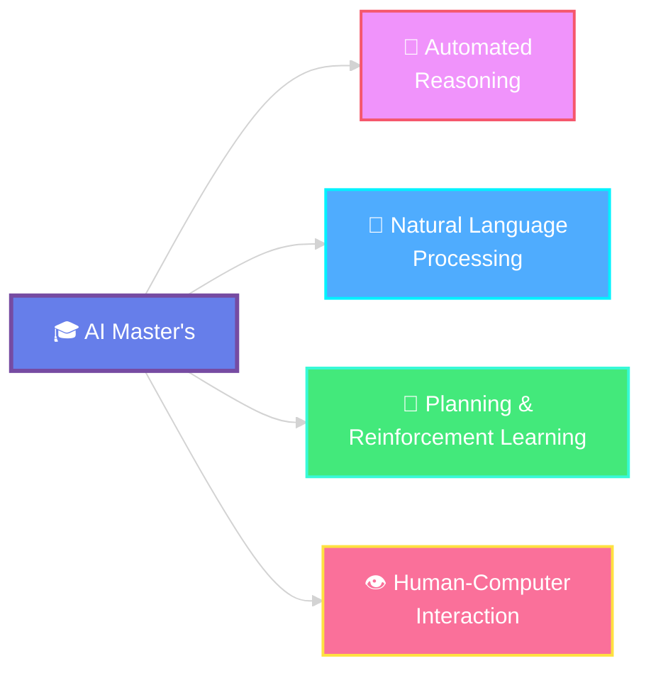

<div align="center">

<!-- Header Banner -->


<br/>

<!-- Badges -->
<p align="center">
  
  
  
  
</p>

<p align="center">
  
  
  
</p>

<br/>

### 🎯 *Comprehensive course materials, lecture notes, and slides*
### 📚 *Everything you need to excel in your AI Master's journey*

<br/>

</div>

## 📂 Repository Structure

```
AI---PRIMO-SEMESTRE/
│
├── 📄 README.md                    # Main repository guide ⭐
├── 📄 LICENSE                      # Educational use license
├── 📄 .gitignore                   # Git ignore rules
│
├── 📁 courses/                     # All course materials 📚
│   │
│   ├── 📁 automated-reasoning/
│   │   ├── notes/                 # LaTeX notes + PDF
│   │   └── slides/                # 5 lecture slides
│   │
│   ├── 📁 natural-language-processing/
│   │   ├── notes/                 # 400+ pages of notes
│   │   └── slides/                # 16 lecture slides
│   │
│   ├── 📁 planning-and-reinforcement-learning/
│   │   ├── notes/                 # 23 pages of notes
│   │   └── slides/                # 6 lecture slides
│   │
│   └── 📁 human-computer-interaction/
│       ├── notes/                 # Theory 2 notes
│       └── slides/
│
└── 📁 docs/                        # Additional resources
    └── CORSI 1 ANNO AI provvisorio.pdf  # Official course info
```

---

<h2 align="center">📚 Course Overview</h2>

<div align="center">
  


</div>

<br/>

<table>
<tr>
<td width="50%" valign="top">

<div align="center">

### 🤖 **Automated Reasoning**
[](courses/automated-reasoning/slides)
[](courses/automated-reasoning/notes)

</div>

> 📄 **AR Appunti.pdf** • LaTeX source available

**🔬 Key Topics:**
```
✓ Logic & Formal Methods
✓ Theorem Proving  
✓ SAT Solving
✓ Constraint Programming
```

</td>
<td width="50%" valign="top">

<div align="center">

### 💬 **Natural Language Processing**
[](courses/natural-language-processing/slides)
[](courses/natural-language-processing/notes)

</div>

> 📄 **NLP Appunti.pdf** • 400+ comprehensive pages

**🔬 Key Topics:**
```
✓ Text Processing & Tokenization
✓ Language Models & Embeddings
✓ Transformers & Attention
✓ Neural NLP Architectures
```

</td>
</tr>
<tr>
<td width="50%" valign="top">

<div align="center">

### 🎯 **Planning & Reinforcement Learning**
[](courses/planning-and-reinforcement-learning/slides)
[](courses/planning-and-reinforcement-learning/notes)

</div>

> 📄 **Planning appunti.pdf** • Detailed foundations

**🔬 Key Topics:**
```
✓ Classical Planning Foundations
✓ State Transition Systems
✓ Action Schemas & STRIPS
✓ SAT Encoding & DWR Domain
```

</td>
<td width="50%" valign="top">

<div align="center">

### 👁️ **Human-Computer Interaction**
[](courses/human-computer-interaction/slides)
[](courses/human-computer-interaction/notes)

</div>

> 📄 **HCI Theory 2 Appunti.pdf** • Multimodal Systems

**🔬 Key Topics:**
```
✓ Multimodal Interaction Design
✓ Visual & Camera-based Systems
✓ Affective Computing
✓ AR/VR Technologies
```

</td>
</tr>
</table>

---

<h2 align="center">🚀 Getting Started</h2>

<div align="center">

### 📥 **Clone the Repository**

```bash
git clone https://github.com/djacoo/AI---PRIMO-SEMESTRE.git
cd AI---PRIMO-SEMESTRE
```

</div>

---

### 📖 **Access Study Materials**

<table>
<tr>
<td width="33%" align="center">

#### 📚 **Notes**
Comprehensive PDFs ready to read

```bash
open courses/<course>/notes/
```

</td>
<td width="33%" align="center">

#### 🎯 **Slides**
Lecture presentations

```bash
open courses/<course>/slides/
```

</td>
<td width="33%" align="center">

#### 📝 **LaTeX Source**
Customizable `.tex` files

```bash
cd courses/<course>/notes/
```

</td>
</tr>
</table>

---

### ⚡ **Quick Navigation Examples**

<details>
<summary><b>🔍 Click to expand examples</b></summary>

<br/>

**View NLP Notes:**
```bash
open courses/natural-language-processing/notes/"NLP Appunti.pdf"
```

**Browse Planning Slides:**
```bash
ls courses/planning-and-reinforcement-learning/slides/
```

**Compile LaTeX from Source:**
```bash
cd courses/automated-reasoning/notes/
pdflatex "AR Appunti.tex"
```

**Quick Course Overview:**
```bash
open docs/"CORSI 1 ANNO AI provvisorio.pdf"
```

</details>

---

## 📜 License & Usage

<div align="center">

**📚 Educational Use Only**

These materials are intended for **personal study and academic reference**.  
Course slides and materials are property of their respective professors and the **University of Verona**.

**Please respect intellectual property rights and academic integrity.**

</div>

---

<div align="center">

## 📊 **Repository Stats**

<table>
  <tr>
    <td align="center">
      
    </td>
    <td align="center">
      
    </td>
    <td align="center">
      
    </td>
    <td align="center">
      
    </td>
  </tr>
</table>

</div>

---

<div align="center">

## 👨‍💻 **Author**


**Master's in Artificial Intelligence**  
🏛️ University of Verona • 2025/2026

[](https://github.com/djacoo)

</div>

---

<div align="center">

### 💡 **Contributions & Feedback**

Found this helpful? ⭐ **Star this repository** to support the project!

<sub>📅 Last updated: October 2025 | Made with ❤️ for AI students</sub>

<br/>


</div>
