<div align="center">

<!-- Header Banner -->


<br/>

<!-- Badges -->
<p align="center">
  
  
  
  
</p>

<p align="center">
  
  
  
</p>

<br/>

### 🎯 *Comprehensive course materials, lecture notes, and slides*
### 🚀 *Everything you need to excel in your AI Master's journey*

<br/>

</div>


<br/>

<div align="center">

## 📂 Repository Structure


</div>

<div align="center">

```text
┏━━━━━━━━━━━━━━━━━━━━━━━━━━━━━━━━━━━━━━━━━━━━━━━━━━━━━━━━━━━━━━┓
┃           🚀 AI---PRIMO-SEMESTRE  ━  Study Repository           ┃
┗━━━━━━━━━━━━━━━━━━━━━━━━━━━━━━━━━━━━━━━━━━━━━━━━━━━━━━━━━━━━━━┛

📄 README.md                         Main repository guide ⭐
📄 LICENSE                           Educational use license
📄 .gitignore                        Git ignore rules

📁 courses/  ━━━━━━━━━━━━━━━  All Course Materials 📚
  │
  ├── 🤖 automated-reasoning/
  │     ├── 📓 notes/               LaTeX + PDF notes
  │     └── 🎯 slides/              5 lectures
  │
  ├── 🗣️ natural-language-processing/
  │     ├── 📕 notes/               400+ pages!
  │     └── 🎯 slides/              16 lectures
  │
  ├── 🎯 planning-and-reinforcement-learning/
  │     ├── 📗 notes/               23 pages
  │     └── 🎯 slides/              6 lectures
  │
  └── 👁️ human-computer-interaction/
        ├── 📙 notes/               Theory 2
        └── 🎯 slides/              Multimodal systems

📁 docs/  ━━━━━━━━━━━━━━━━━  Additional Resources
  └── 📊 CORSI 1 ANNO AI provvisorio.pdf
```

</div>

<br/>


<br/>

<div align="center">

## 📚 Course Overview

```mermaid
%%{init: {'theme':'dark', 'themeVariables': {'fontSize': '16px'}}}%%
graph TD
    A["🎯 AI Master's<br/><b>First Semester</b>"] --> B["🤖 Automated Reasoning<br/>───────────────<br/>📊 5 slides"]
    A --> C["💬 Natural Language Processing<br/>────────────────────<br/>📊 16 slides • 400+ pages"]
    A --> D["🎯 Planning & RL<br/>──────────────<br/>📊 6 slides"]
    A --> E["👁️ Human-Computer Interaction<br/>─────────────────────<br/>📊 Multimodal Systems"]
    
    style A fill:#667eea,stroke:#764ba2,stroke-width:4px,color:#fff,rx:15,ry:15
    style B fill:#f093fb,stroke:#f5576c,stroke-width:3px,color:#fff,rx:10,ry:10
    style C fill:#4facfe,stroke:#00f2fe,stroke-width:3px,color:#fff,rx:10,ry:10
    style D fill:#43e97b,stroke:#38f9d7,stroke-width:3px,color:#fff,rx:10,ry:10
    style E fill:#fa709a,stroke:#fee140,stroke-width:3px,color:#fff,rx:10,ry:10
```
  


</div>

<br/>
<a name="courses"></a>

<table>
<tr>
<td width="50%" valign="top">

<div align="center">

### 🤖 **Automated Reasoning**
[](courses/automated-reasoning/slides)
[](courses/automated-reasoning/notes)

</div>

> 📄 **AR Appunti.pdf** • LaTeX source available

**🔬 Key Topics:**
```
✓ Logic & Formal Methods
✓ Theorem Proving  
✓ SAT Solving
✓ Constraint Programming
```

</td>
<td width="50%" valign="top">

<div align="center">

### 💬 **Natural Language Processing**
[](courses/natural-language-processing/slides)
[](courses/natural-language-processing/notes)

</div>

> 📄 **NLP Appunti.pdf** • 400+ comprehensive pages

**🔬 Key Topics:**
```
✓ Text Processing & Tokenization
✓ Language Models & Embeddings
✓ Transformers & Attention
✓ Neural NLP Architectures
```

</td>
</tr>
<tr>
<td width="50%" valign="top">

<div align="center">

### 🎯 **Planning & Reinforcement Learning**
[](courses/planning-and-reinforcement-learning/slides)
[](courses/planning-and-reinforcement-learning/notes)

</div>

> 📄 **Planning appunti.pdf** • Detailed foundations

**🔬 Key Topics:**
```
✓ Classical Planning Foundations
✓ State Transition Systems
✓ Action Schemas & STRIPS
✓ SAT Encoding & DWR Domain
```

</td>
<td width="50%" valign="top">

<div align="center">

### 👁️ **Human-Computer Interaction**
[](courses/human-computer-interaction/slides)
[](courses/human-computer-interaction/notes)

</div>

> 📄 **HCI Theory 2 Appunti.pdf** • Multimodal Systems

**🔬 Key Topics:**
```
✓ Multimodal Interaction Design
✓ Visual & Camera-based Systems
✓ Affective Computing
✓ AR/VR Technologies
```

</td>
</tr>
</table>

<br/>


<br/>

<div align="center">

## 🚀 Getting Started

</div>

<div align="center">

### 📥 **Clone the Repository**

```bash
git clone https://github.com/djacoo/AI---PRIMO-SEMESTRE.git
cd AI---PRIMO-SEMESTRE
```

</div>

---

### 📖 **Access Study Materials**

<table>
<tr>
<td width="33%" align="center">

#### 📚 **Notes**
Comprehensive PDFs ready to read

```bash
open courses/<course>/notes/
```

</td>
<td width="33%" align="center">

#### 🎯 **Slides**
Lecture presentations

```bash
open courses/<course>/slides/
```

</td>
<td width="33%" align="center">

#### 📝 **LaTeX Source**
Customizable `.tex` files

```bash
cd courses/<course>/notes/
```

</td>
</tr>
</table>

---

### ⚡ **Quick Navigation Examples**

<details>
<summary><b>🔍 Click to expand examples</b></summary>

<br/>

**View NLP Notes:**
```bash
open courses/natural-language-processing/notes/"NLP Appunti.pdf"
```

**Browse Planning Slides:**
```bash
ls courses/planning-and-reinforcement-learning/slides/
```

**Compile LaTeX from Source:**
```bash
cd courses/automated-reasoning/notes/
pdflatex "AR Appunti.tex"
```

**Quick Course Overview:**
```bash
open docs/"CORSI 1 ANNO AI provvisorio.pdf"
```

</details>

<br/>


<br/>

<div align="center">

## 📏 License & Usage

**📚 Educational Use Only**

These materials are intended for **personal study and academic reference**.  
Course slides and materials are property of their respective professors and the **University of Verona**.

**Please respect intellectual property rights and academic integrity.**

</div>

<br/>


<br/>

<div align="center">

## 📊 Repository Stats

<table>
  <tr>
    <td align="center">
      
    </td>
    <td align="center">
      
    </td>
    <td align="center">
      
    </td>
    <td align="center">
      
    </td>
  </tr>
</table>

</div>

<br/>


<br/>

<div align="center">

## 👨‍💻 Author


**Master's in Artificial Intelligence**  
🏛️ University of Verona • 2025/2026

[](https://github.com/djacoo)
[](mailto:jacopo.parretti@studenti.univr.it)

</div>

<br/>


<br/>

<div align="center">

## 💡 Contributions & Feedback

Found this helpful? ⭐ **Star this repository** to support the project!

<br/>

<sub>📅 Last updated: October 2025 | Made with ❤️ for AI students at University of Verona</sub>

<br/><br/>

<!-- Footer -->


</div>
